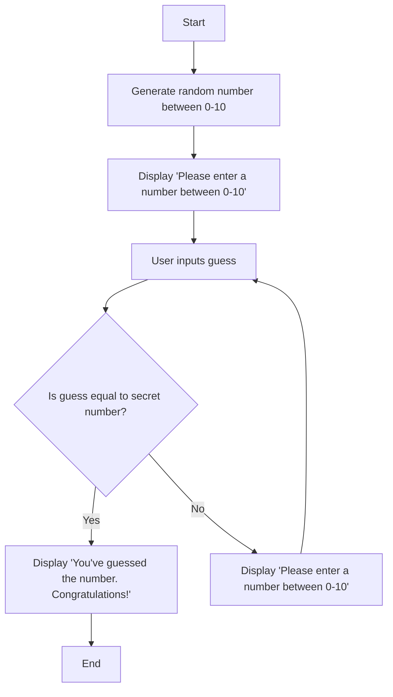

## Documentation
- The algorithm generates a random number between 0 and 10
- A prompt comes up asking the user to guess a number that is between the specified range.
- The user picks a random number between that range.
- If the user's guess is incorrect, the algorithm will return to asking the user for a new input.
- When the user guesses correctly, a message will pop up congratulating him.
