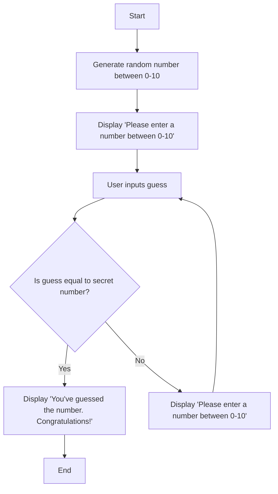

```mermaid
flowchart TD
    A[Start] --> B[Generate random number between 0-10]
    B --> C["Display 'Please enter a number between 0-10'"]
    C --> D[User inputs guess]
    D --> E{Is guess equal to secret number?}
    E -- Yes --> F["Display 'You've guessed the number. Congratulations!'"]
    E -- No --> G["Display 'Please enter a number between 0-10'"]
    G --> D
    F --> H[End]
```
